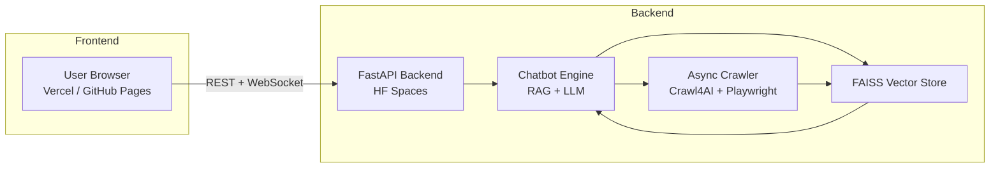

# WebIQ – Technical Documentation

## 1. Executive Summary

WebIQ is an advanced whole‑website intelligence system that enables users to perform conversational query answering over any public website. It crawls entire domains asynchronously, processes extracted content into vector embeddings, and performs retrieval‑augmented generation using local or remote LLMs.

---

## 2. System Goals & USP

### Primary Goal

Transform any website into a fully searchable, conversational knowledge base.

### Unique Selling Proposition (USP)

WebIQ stands apart through:

* **Whole‑website crawling**, not single‑page scraping.
* **Parallel asynchronous crawling** (up to 32 concurrent workers).
* **Browser‑rendered extraction** using Playwright.
* **Markdown‑based clean extraction + noise reduction**.
* **Automatic internal‑link discovery & recursion**.
* **FAISS‑powered vector retrieval**.
* **Support for local GGUF LLMs + OpenAI APIs**.

---

## 3. High‑Level Architecture Diagram



## 4. Component‑Level Architecture

### 4.1 Frontend

* HTML / CSS / JavaScript
* Hosted on GitHub Pages and Vercel
* Communicates via REST & WebSocket
* Features:

  * URL input
  * Real‑time initialization progress
  * Streaming chat UI

### 4.2 Backend (FastAPI)

Handles:

* Session creation
* Background initialization
* Crawl execution
* FAISS store building
* LLM inference
* WebSocket chat

### 4.3 Chatbot Engine

Responsible for:

* Choosing embedding provider (HF / OpenAI)
* Chunking documents
* Building FAISS index
* loading LLM (CTransformers / HF Pipeline / OpenAI)
* Retrieving context + generating response

### 4.4 Crawler Engine (USP)

Implements:

* Async multi‑url crawling
* Internal link auto‑discovery
* Link normalization
* Retry engine
* Markdown extraction
* Noise pruning (PruningContentFilter)

---

## 5. Low‑Level Design (LLD)

### 5.1 File Structure

```
webiq-backend/
│ chatbot.py        # RAG pipeline + LLM 
│ worker.py         # Async crawler engine
│ main.py           # FastAPI REST + 
│ cache/            # Website-specific 
│ requirements.txt
│ README.md
```

### 5.2 Core Classes & Responsibilities

#### **Chatbot** (chatbot.py)

* Initializes RAG pipeline
* Loads LLM
* Runs async retriever
* Formats prompts

#### **Crawler Engine** (worker.py)

* Manages Playwright browser
* Creates batches of concurrent crawls
* Stores extracted content

#### **FastAPI Routes** (main.py)

* `/create_session` – creates session ID
* `/scrape/` – kicks off crawl + RAG build
* `/session_status/` – tracks pipeline progress
* `/ws/chat/` – real‑time chat pipeline

---

## 6. Crawling Subsystem (USP)

### 6.1 Internal Link Discovery

All internal links are extracted:

```
result.links.get("internal", [])
```

Normalized via:

```
urlparse + urlunparse
```

Avoids duplicates with `visited` + `not_visited` sets.

### 6.2 Parallel Async Crawling

Up to 32 concurrent tasks:

```
batch = 32
```

Uses `asyncio.gather()` for high performance.

### 6.3 Markdown Extraction

* Full JS-rendered content
* Filtered via:

```
PruningContentFilter(threshold=0.6)
```

* Removes navigation, ads, scripts

### 6.4 Failure Handling

* If fail → retry once
* If fail again → mark as failed URL

### 6.5 Output Structure

```
cache/<domain>/pages/page_1.txt
cache/<domain>/pages/page_2.txt
...
```

---

## 7. RAG Subsystem (Embeddings + FAISS + LLM)

### 7.1 Chunking

```
chunk_size=500, chunk_overlap=100
```

Recursive splitter used.

### 7.2 Embeddings

Default:

```
BAAI/bge-small-en
```

Supports:

* HuggingFace Embeddings
* OpenAI text-embedding-3-small

### 7.3 FAISS Index

Stored at:

```
<cache>/<domain>/faiss_index_store
```

Loaded with `allow_dangerous_deserialization=True`.

### 7.4 LLM Backends Supported

1. **CTransformers** (GGUF models)
2. **HuggingFacePipeline** (Transformers)
3. **OpenAI GPT-3.5 / GPT-4** (optional)

### 7.5 Prompt Template

_You are a helpful assistant. Use the following context to answer._

_Context: {context}_

_Question: {question}_


## 8. Session & API Architecture

### 8.1 Session Lifecycle

create_session → scrape → initializing → ready → chat

### 8.2 Detailed Flow

1. User creates session
2. Backend starts background crawling task
3. Crawling generates Markdown pages
4. Pages → chunks → embeddings → FAISS
5. LLM + retriever initialized
6. Session marked as “ready”
7. User connects via WebSocket and chats

---

## 9. Sequence Diagrams

### 9.1 Crawling + RAG Build

Frontend → Backend → Crawler → Chatbot → FAISS

### 9.2 Chat Interaction

Frontend → WebSocket → Chatbot → FAISS → LLM → Frontend

---

## 10. Data Flow Diagram

Website → Crawler → Markdown → Chunks → Embeddings → FAISS → LLM → User


## 11. Deployment Architecture

### Backend

* Hosted on HuggingFace Spaces
* CPU-only runtime
* Persistent filesystem
* Requires Playwright installation

### Frontend

* GitHub Pages
* Vercel app mirror

### Network Layer

* REST endpoints
* WebSocket for real-time chat
* CORS restricted to frontend origin

---

## 12. Performance Considerations

* Prefer **GGUF Q4_K_M** models on CPU
* Cache FAISS to skip rebuilds
* Limit crawling depth for large sites
* Avoid huge websites (>1000 pages)
* Use TinyLlama 1.1B for fast HF CPU inference

---

## 13. Scalability Plan

* Horizontal: multiple HF Spaces + load balancer
* Vertical: HF CPU-upgrade (8 vCPU / 32GB)
* Task queue for massive crawling jobs
* Multi-model LLM routing

---

## 14. Security Considerations

* Crawl only public URLs
* Prevent SSRF by restricting URL patterns
* CORS allowed only for known frontends
* No user cookies stored

---

## 15. Limitations

* JS-heavy sites may require full JS rendering
* Large domains can cause crawl timeouts
* HF Spaces CPU limits big LLMs (7B+)
* No incremental diff crawling yet

---

## 16. Future Roadmap

* Token streaming via WebSocket
* Incremental re-crawling (diff-based)
* Visual site map UI
* Sitemap.xml optimized crawling
* Multi-domain comparison RAG
* GPU backend support

---

## 17. Credits

* **Siddharth Chandel** – Backend, RAG, Architecture
* **Vaishnavi Basutkar** – Frontend, UI/UX, Integration
